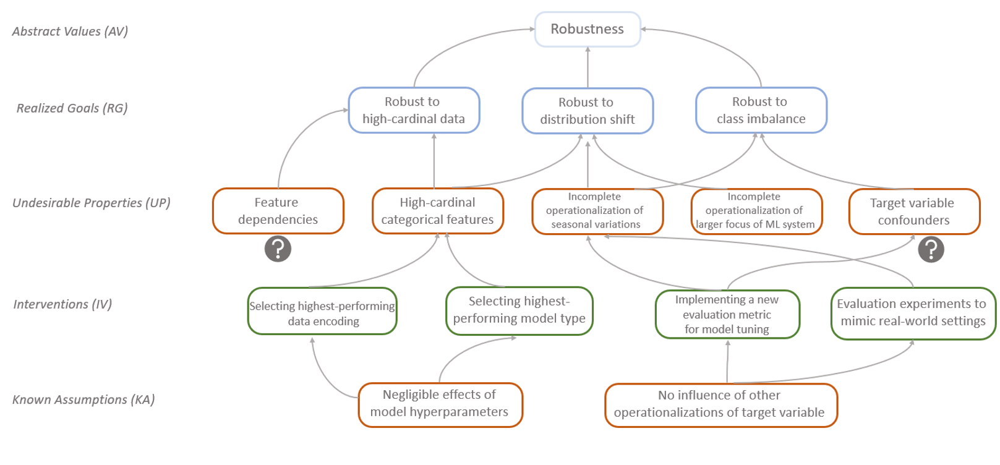

Non-Ideal Methodological Framework for Responsible ML
=====================================================

|DOI| |Citation|

This framework provides a structured approach to bridge the gap between abstract ethical values and concrete technical interventions in Machine Learning.

About
-----

**Context:**
Technical practitioners largely lack a structured way to document or map the imperfections they are trying to resolve, the technical assumptions they make, and the abstract goals they aim to achieve. This often leads to the discounting of several technical choices and creates simplistic pictures in the existing documentation toolkits for ML.

**Approach:**
We draw on non-ideal theorizing of justice and fairness to understand the methodological characteristics and constraints of technical ML practitioners, systematically mapping their assumptions and choices (to perform an intervention) with the intended values of the system they are developing.

**Outcome:**
Our framework requires practitioners to identify five component types central to Responsible ML and establish relationships among them. These components include (a) states of modeling (undesirable data properties and realized goals), actions taken during modeling (technical/non-technical interventions), conceptions (abstract values), and known assumptions.

How to use
----------

Our framework can be used in two ways:

* To facilitate technical practitioners' collaboration with other stakeholders who contribute to value framing (such as managers) and who shed light on assumptions under which interventions are enacted (such as domain experts).
* To serve as a public-facing accountability tool to demonstrate various methodological choices and assumptions made to realize the values of the overall system.

This repository contains tools and guides to help you apply our framework to your projects:

1.  **Visualizer Tool:** A browser-based interface to map your dependencies and generate a directed graph of your methodological logic.

    👉 **Launch Tool:** `https://[YOUR-USERNAME].github.io/[REPO-NAME]/`

2.  **Guidelines:** A detailed explanation of how to identify different components of the framework and map them in the visualizer tool.

    📄 **Read:** `guidelines.rst`

Citation
--------

If you use this framework in your research, please cite the following paper:

**BibTeX:**

.. code-block:: bibtex

   @inproceedings{mothilal2024nonideal,
     author = {Mothilal, Ramaravind Kommiya and Guha, Shion and Ahmed, Syed Ishtiaque},
     title = {Towards a Non-Ideal Methodological Framework for Responsible ML},
     booktitle = {Proceedings of the 2024 CHI Conference on Human Factors in Computing Systems},
     series = {CHI '24},
     year = {2024},
     publisher = {ACM},
     doi = {10.1145/3613904.3642501},
     url = {https://dl.acm.org/doi/full/10.1145/3613904.3642501}
   }

**Text:**
Mothilal, R. K., Guha, S., & Ahmed, S. I. (2024). Towards a Non-Ideal Methodological Framework for Responsible ML. *Proceedings of the 2024 CHI Conference on Human Factors in Computing Systems (CHI '24)*. https://doi.org/10.1145/3613904.3642501

.. |DOI| image:: https://zenodo.org/badge/DOI/10.5281/zenodo.XXXXXX.svg
   :target: https://doi.org/10.5281/zenodo.XXXXXX
   :alt: DOI

.. |Citation| image:: https://img.shields.io/badge/Citation-CHI%2724-blue
   :target: https://dl.acm.org/doi/full/10.1145/3613904.3642501
   :alt: Citation
